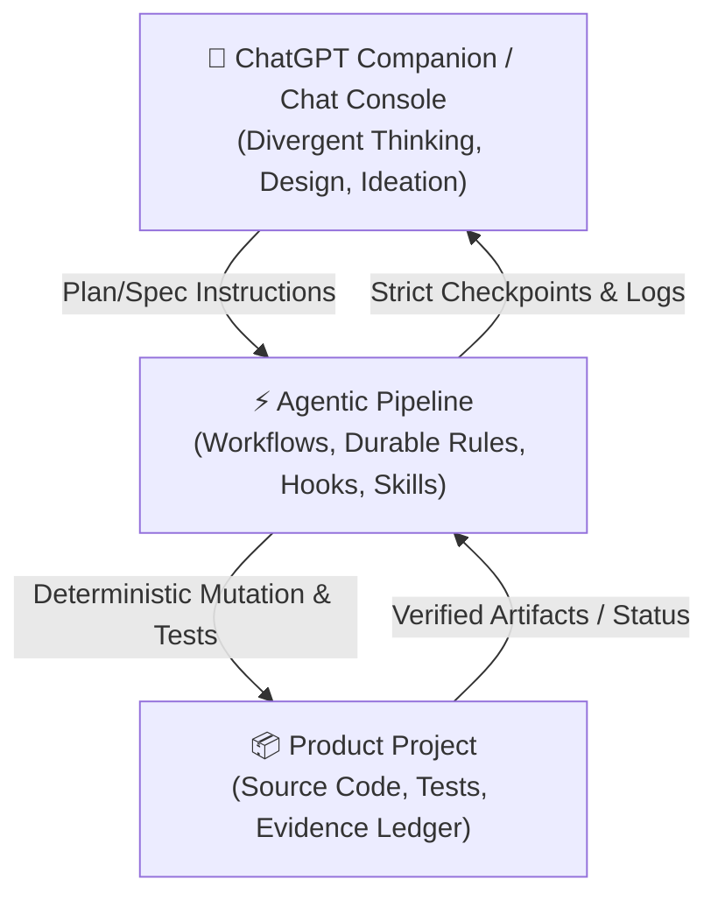

# Agentic Development Pipeline

A lightweight, disciplined, and deterministic framework for coordinating AI agent workflows in local development environments. It prevents AI agents from drifting, skipping phases, or making unverified claims.

**Current package release:** `1.2.3 Distribution Integrity`
**Canonical playbook/runtime:** `1.2.0`
**ChatGPT Companion:** `1.2.1`

---

## 🎯 Value Proposition & Purpose

AI coding assistants are highly capable but prone to **state drift** and **over-claiming**:
1. An agent starts implementing a feature.
2. It mutates dozens of files across multiple modules.
3. It declares the task completed based on its own internal reasoning.
4. The system fails to build, tests fail, or human review reveals extensive unintended side-effects.

**Agentic Pipeline solves this.** It forces a structured, step-by-step loop where the agent cannot proceed to the next phase without providing **deterministic evidence** (passing test runs, clean diffs, and exact terminal commands) and obtaining **explicit human approval** at phase boundaries.

---

## 👥 Who is this for?

*   **Software Engineers** pair-programming with advanced AI agents who want to maintain absolute control over code quality and architecture.
*   **Team Leads** establishing safety guidelines for AI-assisted development.
*   **Security & QA Teams** requiring verifiable, audit-ready compliance trails for AI-generated code.

---

## 🔄 The Three-Layer Operating Model

The pipeline separates reasoning, process, and product code into three distinct planes:



1.  **ChatGPT Companion (Chat Console)**: The entry point for divergent thinking, architecture debates, and high-level goal definition. *Note: The companion is not the executor. The chat console cannot verify safety constraints by itself.*
2.  **Agentic Pipeline (Governance & Environment)**: Coordinates the local agent using strict workflows, durable rules (e.g. `00-project-rules.md`), narrow on-demand skills, and local hooks (`guard_preflight.ps1`).
3.  **Product Project (The Workspace)**: The target codebase containing actual source files, automated test suites, the machine-readable `.agy/PHASE_STATUS.json`, and the append-only `.agy/EVIDENCE_LOG.md`.

> [!IMPORTANT]
> **Core Trust Invariant**: LLM claims in chat are not verification. Deterministic terminal commands, test results, git diffs, screenshots, and exit codes in the workspace are verification.

---

## 🚀 Quick Start

### 🆕 Option A: Starting a New Project on Windows

Run the deterministic installer from the pipeline repository:

```powershell
powershell -NoProfile -ExecutionPolicy Bypass -File .\scripts\windows\Initialize-AgenticProject.ps1 -Mode New -TargetRoot "$env:USERPROFILE\Documents\antigravity\My New Project"
```

The first run is a dry-run. Add `-Apply` after reviewing it. A new project always starts at:

```text
/specdoc
```

### 📂 Option B: Adopting an Existing Project

Adoption is a separate infrastructure operation. Finish active feature work first, then run:

```powershell
powershell -NoProfile -ExecutionPolicy Bypass -File .\scripts\windows\Initialize-AgenticProject.ps1 -Mode Adopt -TargetRoot "C:\path\to\existing-project"
```

After review, add `-Apply`. Adoption starts at `/landing`, followed by `/auditphase`. Existing `.agy` state is not silently overwritten.

Bash users may use:

```bash
bash scripts/bash/adopt-pipeline.sh /path/to/your/project
```

---

## 🗺️ Command Map

Workflows are executed sequentially. Each command represents a strict phase boundary:

```text
  [Idea]
    │
    ▼
/specdoc          # Create the SPEC.md and PROJECT.md requirements
    │
    ▼
/planonly         # Create implementation_plan.md & verification tasks
    │
    ▼
/auditphase       # Verify workspace cleanliness and rule alignment
    │
    ▼
/nextphase        # Implement exactly ONE planned phase and stop
    │
    ▼
/visualqa         # (Optional) Verify browser UI using DevTools MCP
    │
    ▼
/securityaudit    # (Optional) Verify privacy, data flows, and secrets
    │
    ▼
/shipcheck        # Enforce final release checks (tests, status, logs)
    │
    ▼
/githubprepare    # Scaffold README, license, and workflows for GitHub
    │
    ▼
/githubsync       # Safely commit and push updates to the remote repo
```

For minor styling or UI-only edits, the agent may use `/fastpatch` **only** if the local check script allows it:
```powershell
powershell -NoProfile -ExecutionPolicy Bypass -File .\scripts\Test-FastPatchAllowed.ps1
```

---

## ⚓ Evidence-First SHIP/NO-SHIP Philosophy

The decision to publish code is strictly binary and evidence-gated:

*   **SHIP**: Allowed only if `.agy/PHASE_STATUS.json` is fully approved, all automated semantic test runs pass, visual QA reports no regressions, and no high-risk items remain in the risk ledger.
*   **NO-SHIP**: Triggered automatically if any hook fails, a command returns a non-zero exit code, unverified LLM claims exist, or rollback notes are missing.

---

## 🗺️ Documentation Navigation

Explore detailed guides and conceptual articles in Russian and English:

*   **Getting Started**: [START_HERE.en.md](docs/START_HERE.en.md) / [START_HERE.ru.md](docs/START_HERE.ru.md)
*   **Context Control**: [CONTEXT_SPLIT.en.md](docs/concepts/CONTEXT_SPLIT.en.md) explaining how to isolate instructions from codebase knowledge.
*   **Installation**: Detailed environment guides inside [docs/guides/](docs/guides/).
*   **Version History**: [docs/PIPELINE_VERSION_MATRIX.md](docs/PIPELINE_VERSION_MATRIX.md).
*   **Full Index**: Refer to the complete [docs/README.md](docs/README.md) documentation sitemap.

---

## 📜 License

This project is licensed under the MIT License - see the [LICENSE](LICENSE) file for details.
