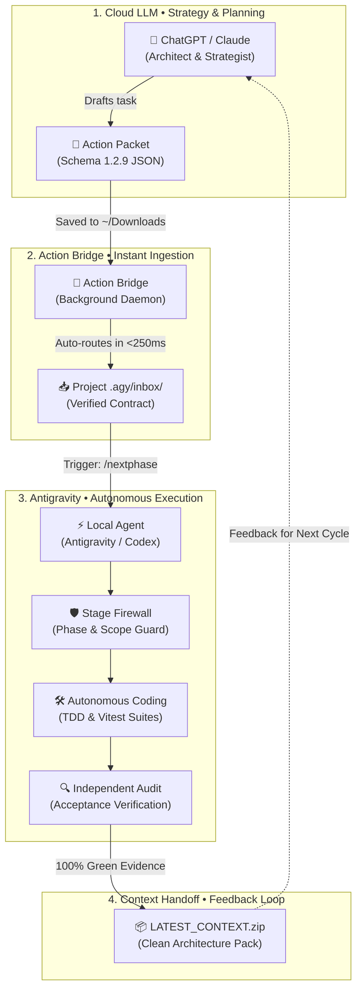

<div align="center">

# ⚡ Agentic Pipeline `v1.2.27`

### *The Reference Implementation of Handoff-Driven Development (HDD) for Antigravity & LLM Companions*

[](VERSION.json)
[](docs/concepts/OPERATING_MODEL.en.md)
[](docs/concepts/OPERATING_MODEL.en.md)
[](scripts/bridge/README.md)
[](.agents/rules/63-scientific-stage-firewall.md)
[](LICENSE)

<p align="center">
  <b><a href="README.md">🇬🇧 English</a></b> • <b><a href="README.ru.md">🇷🇺 Русский</a></b> • <b><a href="docs/reference/COMMANDS_AND_SKILLS_DIRECTORY.md">🧭 Atlas of Skills & Commands</a></b> • <b><a href="docs/guides/BARE_ANTIGRAVITY_SETUP.en.md">🚀 3-Step Setup</a></b>
</p>

---

</div>

## 🌐 The Handoff-Driven Development (HDD) Meta

The era of **single-agent infinite prompt loops** is over. Large context degradation, silent circular hallucinations, and broken builds occur when a single AI tries to be the Architect, the Developer, the Tester, and the Auditor in a single messy thread.

**Agentic Pipeline is the reference implementation of Handoff-Driven Development:**

```text
┌─────────────────────────────────────────────────────────────────────────────────────────────┐
│                          HANDOFF-DRIVEN DEVELOPMENT LIFECYCLE                               │
├─────────────────────────────────────────────────────────────────────────────────────────────┤
│                                                                                             │
│  [1. STRATEGIST / CLOUD LLM]                                                                │
│   ChatGPT / Claude / GPT-5  ──(Drafts Action Packet)──►  AGENTIC_ACTION_PACKET_*.json       │
│                                                                  │                          │
│                                                          (Downloads)                        │
│                                                                  ▼                          │
│  [2. ZERO-FRICTION BRIDGE]                                                                  │
│   Action Bridge Daemon (250ms)  ──(Token Verification)──►  Target Project .agy/inbox/      │
│                                                                  │                          │
│                                                          (/nextphase)                       │
│                                                                  ▼                          │
│  [3. AUTONOMOUS LOCAL AGENT]                                                                │
│   Antigravity IDE / Codex   ──►  Stage Firewall Check  ──►  Autonomous Code & Tests         │
│                                                                  │                          │
│                                                          (100% Green)                       │
│                                                                  ▼                          │
│  [4. CONTEXT HANDOFF & CLOSURE]                                                             │
│   LATEST_CONTEXT.zip (1-2 MB)  ◄──(Audit & Verification)──  Evidence Report & Receipts      │
│         │                                                                                   │
│         └────────────────(Returned to Strategist for Next Cycle)───────────────────────────►┘
```

---

## 🗺️ Visual Architecture Diagram


```mermaid
flowchart TD
    subgraph S1["1. Cloud LLM • Strategy & Planning"]
        A["🧠 ChatGPT / Claude<br/>(Architect &amp; Strategist)"]
        B["📄 Action Packet<br/>(Schema 1.2.9 JSON)"]
        A -->|"Drafts task"| B
    end

    subgraph S2["2. Action Bridge • Instant Ingestion"]
        C["🌉 Action Bridge<br/>(Background Daemon)"]
        D["📥 Project .agy/inbox/<br/>(Verified Contract)"]
        C -->|"Auto-routes in &lt;250ms"| D
    end

    subgraph S3["3. Antigravity • Autonomous Execution"]
        E["⚡ Local Agent<br/>(Antigravity / Codex)"]
        F["🛡️ Stage Firewall<br/>(Phase &amp; Scope Guard)"]
        G["🛠️ Autonomous Coding<br/>(TDD &amp; Vitest Suites)"]
        H["🔍 Independent Audit<br/>(Acceptance Verification)"]
        E --> F --> G --> H
    end

    subgraph S4["4. Context Handoff • Feedback Loop"]
        I["📦 LATEST_CONTEXT.zip<br/>(Clean Architecture Pack)"]
    end

    B -->|"Saved to ~/Downloads"| C
    D -->|"Trigger: /nextphase"| E
    H -->|"100% Green Evidence"| I
    I -.->|"Feedback for Next Cycle"| A
```

---

## 🚀 2-Minute Setup on Bare Antigravity

Deploy the complete ecosystem on a fresh machine in **3 simple commands**:

### Step 1: Clone the repository
```powershell
cd "$env:USERPROFILE\Documents\antigravity"
git clone https://github.com/0xAgentive/agentic-pipeline.git
cd agentic-pipeline
```

### Step 2: Install Global Skills (1 Click)
```powershell
& pwsh -NoProfile -ExecutionPolicy Bypass -File "./scripts/windows/Install-GlobalSkills.ps1"
```
*This instantly registers all 6 global pipeline skills (`agentic-project-scaffold`, `companion-project-context-pack`, `local-artifact-delivery`, etc.) in `~/.gemini/config/skills/` across all your workspaces.*

### Step 3: Create your first project!
Open Antigravity chat and simply type:
```text
/new-project MyCoolProject
```
*Done! The agent initializes Git, deploys governance rules, registers Action Bridge, and outputs an initial Context ZIP for ChatGPT.*

*(To onboard an existing repository, simply type: `/adopt-project C:\path\to\existing-repo`)*

---

## 🚀 Key Superpowers

<table>
  <tr>
    <td width="50%">
      <h3>⚡ Action Bridge (Sub-Second Ingestion)</h3>
      <p>Download an Action Packet from ChatGPT, and the local Action Bridge captures, authenticates, and routes it to the exact target project in <b>&lt; 250 ms</b> with zero manual copy-pasting.</p>
    </td>
    <td width="50%">
      <h3>📦 Pure Architecture Context Packer</h3>
      <p>Compresses 100% of the project's source, tests, schemas, and algorithms into a featherlight <b>1–2 MB ZIP</b>, intelligently stripping out gigabytes of <code>node_modules</code>, caches, and sensor binaries.</p>
    </td>
  </tr>
  <tr>
    <td width="50%">
      <h3>🛡️ Scientific Stage Firewall</h3>
      <p>Strict deterministic governance that prevents premature phase jumps (e.g. from analytical validation to empirical release) and enforces protocol freezes.</p>
    </td>
    <td width="50%">
      <h3>🎯 1-Click Project Scaffolding</h3>
      <p>Initialize a new production repository or onboard an existing codebase into the pipeline with a single command: <code>/new-project &lt;Name&gt;</code> or <code>/adopt-project &lt;Path&gt;</code>.</p>
    </td>
  </tr>
</table>

---

## 🧭 Core Commands & Skills Cheat Sheet

| Command | Category | Purpose (In Plain Language) | Trigger / Usage |
|:---|:---:|:---|:---|
| **`/new-project`** | 🚀 Setup | Bootstraps a brand-new project with full pipeline governance from scratch | `/new-project MyProject` |
| **`/adopt-project`** | 🚀 Setup | Onboards an existing codebase without mutating existing source code | `/adopt-project C:\repo` |
| **`/companion-pack`** | 📦 Context | Packages pure architectural source for ChatGPT / Claude into a 1MB ZIP | `/companion-pack` |
| **`/nextphase`** | ⚙️ Execution | Executes the approved Action Packet task autonomously | `/nextphase` or *«start»* |
| **`/goal`** | 🧠 Mode | Modifier for deep autonomy: prevents stopping until 100% verified | `/nextphase /goal` |
| **`/auditphase`** | 🔍 Quality | Executes an independent, read-only audit of acceptance criteria and metrics | `/auditphase` |
| **`/fixcritical`** | 🔧 Repair | Repairs confirmed critical defects registered in `FINDINGS.json` | `/fixcritical` |
| **`/fastpatch`** | ⚡ Patch | Lightweight, direct patch for small 1–3 line bugfixes or typos | `/fastpatch` |
| **`/stitch-sync`** | 🎨 UI/UX | Synchronizes UI screens, tokens, and layouts into Google Stitch canvas | `/stitch-sync` |
| **`/interview-me`** | 💡 Brainstorm | Disciplined 1-question-at-a-time interview to clarify product intent | *«interview me»* |

👉 **[View the Complete Interactive Atlas of 24+ Skills & Commands →](docs/reference/COMMANDS_AND_SKILLS_DIRECTORY.md)**  
👉 **[Open the Interactive Web UI Dashboard →](docs/reference/COMMANDS_AND_SKILLS_DASHBOARD.html)**

---

## 📂 Repository Structure

```text
agentic-pipeline/
├── .agents/                    # Universal Agent Workflows, Rules, and Skills
│   ├── rules/                  # Governance, Safety, Evidence, and Firewall Rules
│   ├── skills/                 # High-leverage engineering skills (TDD, Code Review, etc.)
│   └── workflows/              # Slash commands (/nextphase, /auditphase, /fixcritical, etc.)
├── .agy/                       # Machine Control Plane & Verification Manifests
├── docs/                       # Comprehensive Architecture & User Guides
│   ├── guides/                 # Step-by-step setup guides (EN/RU)
│   ├── concepts/               # Theoretical operating models
│   └── reference/              # Canonical Atlas, Schemas, and Cheatsheets
├── schemas/                    # Formal JSON Schemas (Action Packet 1.2.9, Findings, etc.)
├── scripts/                    # Automation Tooling
│   ├── bridge/                 # Companion Action Bridge (Sub-second Ingestion)
│   ├── control-plane/          # Node.js validation & convergence runners
│   └── windows/                # PowerShell 7 installers, testers, and orchestrators
├── skills/                     # Global Antigravity Skills distributable
└── templates/                  # Base Project Scaffolding Templates
```

---

## 🔒 Security & Privacy Guarantees

1. **100% Offline Product Execution**: No secret keys, proprietary database rows, or private sensor data are transmitted to external APIs during local code runs.
2. **Deterministic Privacy Scrubbing**: Action Packets and Companion Context Packs automatically strip absolute local paths, personal names, and device hardware serial numbers.
3. **Cryptographic Capability Binding**: Each project generates a unique 64-hex capability token (`ACTION_BRIDGE_CAPABILITY.json`) preventing unauthorized packet injection across projects.

---

## 📄 License & Standards

- **License**: MIT License (see [LICENSE](LICENSE)).
- **Standard**: Agentic Pipeline Specification `v1.2.27`.
- **Maintained by**: Google Antigravity & Agentic Engineering Community.
