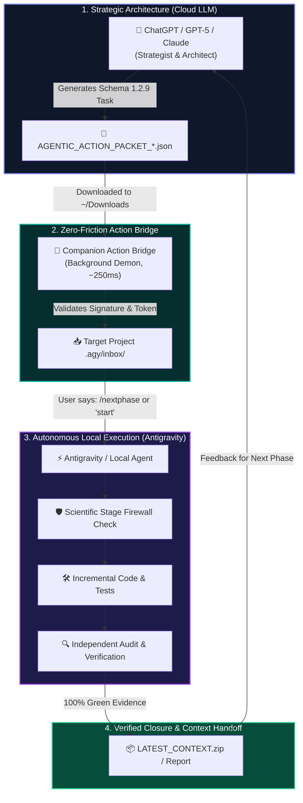

<div align="center">

# ⚡ Agentic Pipeline `v1.2.27`

### *The Asymmetric Dual-Agent Operating System for Deterministic, Autonomous Software Engineering*

[](VERSION.json)
[](docs/START_HERE.en.md)
[](docs/concepts/OPERATING_MODEL.en.md)
[](scripts/bridge/README.md)
[](.agents/rules/63-scientific-stage-firewall.md)
[](LICENSE)

<p align="center">
  <b><a href="README.md">🇬🇧 English</a></b> • <b><a href="README.ru.md">🇷🇺 Русский</a></b> • <b><a href="docs/reference/COMMANDS_AND_SKILLS_DIRECTORY.md">🧭 Atlas of Skills & Commands</a></b> • <b><a href="docs/START_HERE.en.md">🚀 Quick Start</a></b>
</p>

---

</div>

## 💡 What is Agentic Pipeline?

**Agentic Pipeline** is an enterprise-grade framework designed to coordinate **asymmetric AI agents** (High-Level Reasoning LLMs like ChatGPT / Claude / GPT-5 and Local Execution Agents like Google Antigravity / Codex) to build and maintain complex software with **zero hallucinations, strict stage boundaries, and verifiable evidence**.

### The Problem with Traditional AI Coding
```text
❌ Human pastes huge prompts back and forth between web and local editor
❌ AI hallucinates "done" while tests fail and dependencies break
❌ Unbounded edits mutate frozen architectures or pollute clinical/empirical data
❌ Gigabytes of logs, node_modules, and cache files clog context windows
```

### The Agentic Pipeline Solution
```text
✅ ChatGPT / Claude acts as the Architect & Strategist (drafts formal Action Packets)
✅ Background Action Bridge ingests tasks automatically in ~250 ms from Downloads
✅ Antigravity acts as the Autonomous Local Executor (runs compilers, tests, Git, Python)
✅ Stage Firewall blocks forbidden stage transitions, data leakage, and protocol drift
✅ Compact Owner Reports (4 human-friendly sections) + Deterministic Evidence Machine Truth
```

---

## 🗺️ Dual-Agent Asymmetric Architecture


```mermaid
flowchart TD
    subgraph Strat["1. Strategic Architecture (Cloud LLM)"]
        A["🧠 ChatGPT / GPT-5 / Claude<br/>(Strategist & Architect)"] -->|"Generates Schema 1.2.9 Task"| B["📄 AGENTIC_ACTION_PACKET_*.json"]
    end

    subgraph Bridge["2. Zero-Friction Action Bridge"]
        B -->|"Downloaded to ~/Downloads"| C["🌉 Companion Action Bridge<br/>(Background Demon, ~250ms)"]
        C -->|"Validates Signature & Token"| D["📥 Target Project .agy/inbox/"]
    end

    subgraph Exec["3. Autonomous Local Execution (Antigravity)"]
        D -->|"User says: /nextphase or 'start'"| E["⚡ Antigravity / Local Agent"]
        E --> F["🛡️ Scientific Stage Firewall Check"]
        F --> G["🛠️ Incremental Code & Tests"]
        G --> H["🔍 Independent Audit & Verification"]
    end

    subgraph Handoff["4. Verified Closure & Context Handoff"]
        H -->|"100% Green Evidence"| I["📦 LATEST_CONTEXT.zip / Report"]
        I -->|"Feedback for Next Phase"| A
    end

    style Strat fill:#0f172a,stroke:#818cf8,stroke-width:2px,color:#fff
    style Bridge fill:#042f2e,stroke:#14b8a6,stroke-width:2px,color:#fff
    style Exec fill:#1e1b4b,stroke:#a855f7,stroke-width:2px,color:#fff
    style Handoff fill:#064e3b,stroke:#34d399,stroke-width:2px,color:#fff
```

---

## 🚀 Key Superpowers

<table>
  <tr>
    <td width="50%">
      <h3>⚡ Action Bridge (Sub-Second Ingestion)</h3>
      <p>Download an Action Packet from ChatGPT, and the local Action Bridge captures, authenticates, and routes it to the exact target project in <b>&lt; 250 ms</b> with zero manual copy-pasting.</p>
    </td>
    <td width="50%">
      <h3>📦 Pure Architecture Context Packer</h3>
      <p>Compresses 100% of the project's source, tests, schemas, and algorithms into a featherlight <b>1–2 MB ZIP</b>, intelligently stripping out gigabytes of <code>node_modules</code>, caches, and sensor binaries.</p>
    </td>
  </tr>
  <tr>
    <td width="50%">
      <h3>🛡️ Scientific Stage Firewall</h3>
      <p>Strict deterministic governance that prevents premature phase jumps (e.g. from analytical validation to empirical release) and enforces protocol freezes.</p>
    </td>
    <td width="50%">
      <h3>🎯 1-Click Project Scaffolding</h3>
      <p>Initialize a new production repository or onboard an existing codebase into the pipeline with a single command: <code>/new-project &lt;Name&gt;</code> or <code>/adopt-project &lt;Path&gt;</code>.</p>
    </td>
  </tr>
</table>

---

## ⚡ Quick Start in 4 Simple Steps

### 1. Scaffold a new project (or adopt an existing one)
Inside Antigravity, type:
```text
/new-project CardioTracker
```
*or adopt an existing repo:*
```text
/adopt-project C:\path\to\my-existing-app
```
*The pipeline automatically initializes Git, deploys `.agents/` and `.agy/`, registers the project in Action Bridge, and outputs an initial Companion Context ZIP.*

### 2. Hand off context to ChatGPT / Claude
Attach the generated context ZIP (`<PROJECT>_COMPREHENSIVE_COMPANION_PACK.zip`) to your ChatGPT / Claude conversation and paste the bundled system prompt.

### 3. Download the Action Packet from your Companion
Your Companion will draft an architectural plan and output a single-file `AGENTIC_ACTION_PACKET_<project>_<timestamp>.json`. Simply download it to your default `Downloads` folder.

### 4. Tell Antigravity to execute
Open your Antigravity chat and say:
```text
/nextphase
```
*(or `/nextphase /goal` for complex long-running tasks)*. Antigravity reads the packet from disk, executes the code, runs the test suite, performs an independent audit, and prints a concise 4-section summary.

---

## 🧭 Core Commands & Skills Cheat Sheet

| Command | Category | Purpose (In Plain Language) | Trigger / Usage |
|:---|:---:|:---|:---|
| **`/new-project`** | 🚀 Setup | Bootstraps a brand-new project with full pipeline governance from scratch | `/new-project MyProject` |
| **`/adopt-project`** | 🚀 Setup | Onboards an existing codebase without mutating existing source code | `/adopt-project C:\repo` |
| **`/companion-pack`** | 📦 Context | Packages pure architectural source for ChatGPT / Claude into a 1MB ZIP | `/companion-pack` |
| **`/nextphase`** | ⚙️ Execution | Executes the approved Action Packet task autonomously | `/nextphase` or *«start»* |
| **`/goal`** | 🧠 Mode | Modifier for deep autonomy: prevents stopping until 100% verified | `/nextphase /goal` |
| **`/auditphase`** | 🔍 Quality | Executes an independent, read-only audit of acceptance criteria and metrics | `/auditphase` |
| **`/fixcritical`** | 🔧 Repair | Repairs confirmed critical defects registered in `FINDINGS.json` | `/fixcritical` |
| **`/fastpatch`** | ⚡ Patch | Lightweight, direct patch for small 1–3 line bugfixes or typos | `/fastpatch` |
| **`/stitch-sync`** | 🎨 UI/UX | Synchronizes UI screens, tokens, and layouts into Google Stitch canvas | `/stitch-sync` |
| **`/interview-me`** | 💡 Brainstorm | Disciplined 1-question-at-a-time interview to clarify product intent | *«interview me»* |

👉 **[View the Complete Interactive Atlas of 24+ Skills & Commands →](docs/reference/COMMANDS_AND_SKILLS_DIRECTORY.md)**  
👉 **[Open the Interactive Web UI Dashboard →](docs/reference/COMMANDS_AND_SKILLS_DASHBOARD.html)**

---

## 📂 Repository Structure

```text
agentic-pipeline/
├── .agents/                    # Universal Agent Workflows, Rules, and Skills
│   ├── rules/                  # Governance, Safety, Evidence, and Firewall Rules
│   ├── skills/                 # High-leverage engineering skills (TDD, Code Review, etc.)
│   └── workflows/              # Slash commands (/nextphase, /auditphase, /fixcritical, etc.)
├── .agy/                       # Machine Control Plane & Verification Manifests
├── docs/                       # Comprehensive Architecture & User Guides
│   ├── guides/                 # Step-by-step setup guides (EN/RU)
│   ├── concepts/               # Theoretical operating models
│   └── reference/              # Canonical Atlas, Schemas, and Cheatsheets
├── schemas/                    # Formal JSON Schemas (Action Packet 1.2.9, Findings, etc.)
├── scripts/                    # Automation Tooling
│   ├── bridge/                 # Companion Action Bridge (Sub-second Ingestion)
│   ├── control-plane/          # Node.js validation & convergence runners
│   └── windows/                # PowerShell 7 installers, testers, and orchestrators
└── templates/                  # Base Project Scaffolding Templates
```

---

## 🔒 Security & Privacy Guarantees

1. **100% Offline Product Execution**: No secret keys, proprietary database rows, or private sensor data are transmitted to external APIs during local code runs.
2. **Deterministic Privacy Scrubbing**: Action Packets and Companion Context Packs automatically strip absolute local paths, personal names, and device hardware serial numbers.
3. **Cryptographic Capability Binding**: Each project generates a unique 64-hex capability token (`ACTION_BRIDGE_CAPABILITY.json`) preventing unauthorized packet injection across projects.

---

## 📄 License & Standards

- **License**: MIT License (see [LICENSE](LICENSE)).
- **Standard**: Agentic Pipeline Specification `v1.2.27`.
- **Maintained by**: Google Antigravity & Agentic Engineering Community.
