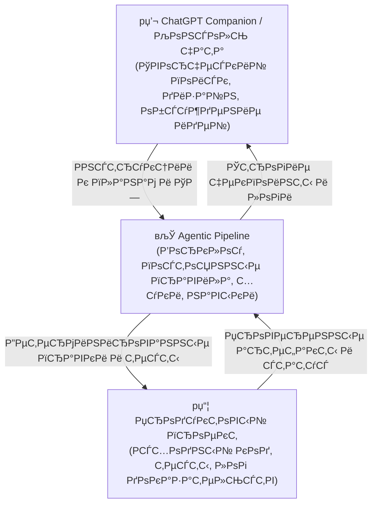

# Agentic Development Pipeline (Агентский пайплайн разработки)

Легковесный, строгий и детерминированный фреймворк для координации работы ИИ-агентов в локальной среде разработки. Он предотвращает отклонение агента от намеченной цели (state drift), пропуск фаз и отправку непроверенного кода.

---

## 🎯 Назначение и ценность продукта

ИИ-ассистенты для написания кода обладают огромным потенциалом, но склонны к **рассинхронизации состояния** (state drift) и **избыточной уверенности**:
1. Агент начинает писать код для новой фичи.
2. Он вносит изменения в десятки файлов в самых разных модулях.
3. Он заявляет о завершении задачи, основываясь лишь на собственной внутренней логике.
4. В итоге проект не собирается, тесты падают, а ручная проверка выявляет массу непредвиденных багов.

**Agentic Pipeline решает эту проблему.** Он принудительно задает строгий пошаговый цикл, в котором агент не может перейти к следующей фазе, пока не предоставит **детерминированные доказательства** (успешный запуск тестов, чистый diff и точные команды терминала) и не получит **явное одобрение человека** на границе текущей фазы.

---

## 👥 Для кого это?

*   **Разработчики**, работающие в паре с передовыми ИИ-агентами и желающие полностью контролировать качество кода и архитектуру проекта.
*   **Тимлиды**, внедряющие безопасные регламенты использования ИИ в командах.
*   **Специалисты по безопасности и QA**, которым требуется проверяемый, готовый к аудиту лог изменений (audit trail) для кода, написанного нейросетью.

---

## 🔄 Трехслойная операционная модель

Пайплайн разделяет рассуждения, процесс и продуктовый код на три независимые плоскости:



1.  **ChatGPT Companion (Консоль чата)**: Точка входа для обсуждения архитектуры, генерации идей и формулирования высокоуровневых целей. *Примечание: компаньон в чате не является исполнителем. Консоль чата сама по себе не может гарантировать соблюдение правил безопасности.*
2.  **Agentic Pipeline (Управление и среда)**: Координирует агента на локальной машине с помощью строгих сценариев (workflows), постоянных правил проекта (например, `00-project-rules.md`), специализированных точечных навыков (skills) и локальных скриптов-хуков (`guard_preflight.ps1`).
3.  **Продуктовый проект (Рабочее пространство)**: Целевая кодовая база, содержащая исходные файлы, тесты, машиночитаемый файл состояния `.agy/PHASE_STATUS.json` и инкрементный журнал доказательств `.agy/EVIDENCE_LOG.md`.

> [!IMPORTANT]
> **Главный инвариант доверия**: Заявления LLM в чате не являются подтверждением выполнения задачи. Единственным подтверждением являются детерминированные команды терминала, результаты тестов, git diff, скриншоты и коды возврата (exit codes) в рабочей области.

---

## 🚀 Быстрый старт

Убедитесь, что на вашей локальной машине настроены [Google Antigravity](https://github.com/google/antigravity) и git.

### 🆕 Вариант А: Запуск нового проекта
1.  Скопируйте содержимое папки `templates/agy-project-base/` в новую директорию проекта.
2.  Откройте эту директорию в рабочем пространстве с поддержкой Antigravity.
3.  Инициализируйте спецификацию (ТЗ):
    ```text
    /specdoc
    ```
4.  Создайте план реализации:
    ```text
    /planonly
    ```

### 📂 Вариант Б: Подключение к действующему проекту
Запустите скрипт интеграции, чтобы развернуть конфигурацию пайплайна в существующей директории:
```bash
bash scripts/bash/adopt-pipeline.sh /path/to/your/project
```
Затем выполните первичный аудит окружения:
```text
/auditphase
```

---

## 🗺️ Карта команд фреймворка

Команды воркфлоу выполняются строго последовательно. Каждая из них обозначает жесткую границу фазы:

```text
  [Идея]
    в”‚
    в–ј
/specdoc          # Создание файлов SPEC.md и PROJECT.md с требованиями
    в”‚
    в–ј
/planonly         # Написание плана (implementation_plan.md) и задач проверки
    в”‚
    в–ј
/auditphase       # Проверка чистоты рабочей области и соответствия правилам
    в”‚
    в–ј
/nextphase        # Выполнение ровно ОДНОЙ запланированной фазы и остановка
    в”‚
    в–ј
/visualqa         # (Опционально) Проверка UI в браузере через Chrome DevTools MCP
    в”‚
    в–ј
/securityaudit    # (Опционально) Проверка конфиденциальности, потоков данных и секретов
    в”‚
    в–ј
/shipcheck        # Финальный контроль готовности к релизу (тесты, статусы, логи)
    в”‚
    в–ј
/githubprepare    # Генерация README, лицензии и workflow-файлов для GitHub
    в”‚
    в–ј
/githubsync       # Безопасный коммит и отправка обновлений в GitHub-репозиторий
```

Для небольших правок интерфейса или стилей агент может использовать команду `/fastpatch` **только** в том случае, если локальный скрипт проверки дал на это разрешение:
```powershell
powershell -NoProfile -ExecutionPolicy Bypass -File .\scripts\Test-FastPatchAllowed.ps1
```

---

## ⚓ Концепция SHIP/NO-SHIP на основе доказательств

Решение о публикации кода носит строго бинарный характер и блокируется гейтами:

*   **SHIP (Выпускать)**: Разрешено только если состояние `.agy/PHASE_STATUS.json` полностью согласовано, все автоматические семантические тесты выполнены успешно, визуальный QA не выявил регрессий, а в реестре рисков отсутствуют критические угрозы.
*   **NO-SHIP (Не выпускать)**: Срабатывает автоматически, если любой хук вернул ошибку, команда завершилась с ненулевым кодом выхода, в кодовой базе остались неподтвержденные заявления модели или отсутствуют инструкции по откату изменений.

---

## 🗺️ Навигация по документации

Подробные руководства и концептуальные статьи доступны на русском и английском языках:

*   **Начало работы**: [START_HERE.en.md](docs/START_HERE.en.md) / [START_HERE.ru.md](docs/START_HERE.ru.md)
*   **Разделение контекста**: [CONTEXT_SPLIT.ru.md](docs/concepts/CONTEXT_SPLIT.ru.md) — о том, как изолировать инструкции агента от проектных знаний.
*   **Инсталляция**: Инструкции по настройке путей к обёрткам в папке [docs/guides/](docs/guides/).
*   **История версий**: Таблица версий [docs/PIPELINE_VERSION_MATRIX.md](docs/PIPELINE_VERSION_MATRIX.md).
*   **Общий индекс**: Полная карта документации представлена в [docs/README.md](docs/README.md).

---

## 📜 Лицензия

Проект распространяется под лицензией MIT. Подробные условия смотрите в файле [LICENSE](LICENSE).
