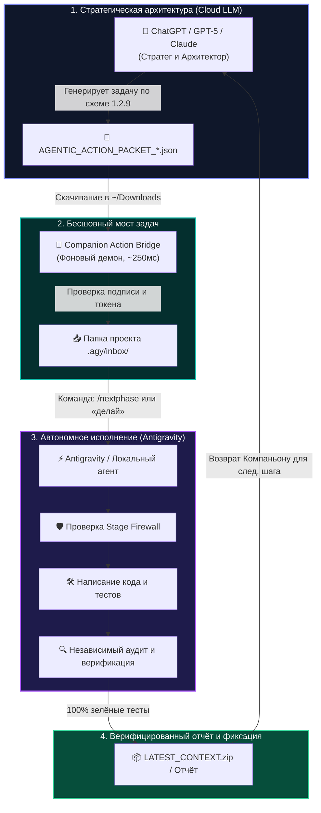

<div align="center">

# ⚡ Agentic Pipeline `v1.2.27`

### *Асимметричная двухагентная операционная система для детерминированной автономной разработки*

[](VERSION.json)
[](docs/START_HERE.ru.md)
[](docs/concepts/OPERATING_MODEL.ru.md)
[](scripts/bridge/README.md)
[](.agents/rules/63-scientific-stage-firewall.md)
[](LICENSE)

<p align="center">
  <b><a href="README.md">🇬🇧 English</a></b> • <b><a href="README.ru.md">🇷🇺 Русский</a></b> • <b><a href="docs/reference/COMMANDS_AND_SKILLS_DIRECTORY.md">🧭 Атлас Скиллов и Команд</a></b> • <b><a href="docs/START_HERE.ru.md">🚀 Быстрый старт</a></b>
</p>

---

</div>

## 💡 Что такое Agentic Pipeline?

**Agentic Pipeline** — это промышленный фреймворк для согласованной работы **асимметричных ИИ-агентов**: облачных моделей высокого уровня рассуждений (ChatGPT / Claude / GPT-5) и локальных исполнительных сред (Google Antigravity / Codex). 

Фреймворк решает главную проблему ИИ-разработки: **полностью исключает галлюцинации, самовольные изменения архитектуры и поломку тестов**, гарантируя строгое следование стадиям проекта и математическую воспроизводимость.

### Проблема традиционной разработки с ИИ
```text
❌ Человек бесконечно копирует огромные промпты между браузером и редактором
❌ Модель утверждает «Всё готово!», пока тесты падают, а зависимости ломаются
❌ Агент самовольно перескакивает через фазы проекта или портит эталонные данные
❌ Гигабайты node_modules, кэшей и дампов забивают окно контекста модели
```

### Решение Agentic Pipeline
```text
✅ ChatGPT / Claude выступает Стратегом и Архитектором (выдаёт чёткие Action Packets)
✅ Фоновый Action Bridge за ~250 мс перехватывает задачи из папки Downloads
✅ Antigravity выступает Локальным Исполнителем (компиляция, тесты, Git, SciPy)
✅ Stage Firewall блокирует несанкционированные переходы и утечки данных
✅ Компактные отчёты для владельца (4 понятных пункта) + машинная правда аудита
```

---

## 🗺️ Асимметричная двухагентная архитектура


```mermaid
flowchart TD
    subgraph Strat["1. Стратегическая архитектура (Cloud LLM)"]
        A["🧠 ChatGPT / GPT-5 / Claude<br/>(Стратег и Архитектор)"] -->|"Генерирует задачу по схеме 1.2.9"| B["📄 AGENTIC_ACTION_PACKET_*.json"]
    end

    subgraph Bridge["2. Бесшовный мост задач"]
        B -->|"Скачивание в ~/Downloads"| C["🌉 Companion Action Bridge<br/>(Фоновый демон, ~250мс)"]
        C -->|"Проверка подписи и токена"| D["📥 Папка проекта .agy/inbox/"]
    end

    subgraph Exec["3. Автономное исполнение (Antigravity)"]
        D -->|"Команда: /nextphase или «делай»"| E["⚡ Antigravity / Локальный агент"]
        E --> F["🛡️ Проверка Stage Firewall"]
        F --> G["🛠️ Написание кода и тестов"]
        G --> H["🔍 Независимый аудит и верификация"]
    end

    subgraph Handoff["4. Верифицированный отчёт и фиксация"]
        H -->|"100% зелёные тесты"| I["📦 LATEST_CONTEXT.zip / Отчёт"]
        I -->|"Возврат Компаньону для след. шага"| A
    end

    style Strat fill:#0f172a,stroke:#818cf8,stroke-width:2px,color:#fff
    style Bridge fill:#042f2e,stroke:#14b8a6,stroke-width:2px,color:#fff
    style Exec fill:#1e1b4b,stroke:#a855f7,stroke-width:2px,color:#fff
    style Handoff fill:#064e3b,stroke:#34d399,stroke-width:2px,color:#fff
```

---

## 🚀 Ключевые возможности

<table>
  <tr>
    <td width="50%">
      <h3>⚡ Action Bridge (Захват за миллисекунды)</h3>
      <p>Вы скачиваете файл задачи из диалога с ChatGPT, и фоновый мост за <b>&lt; 250 мс</b> аутентифицирует и доставляет его прямо в рабочий каталог проекта без ручного копирования.</p>
    </td>
    <td width="50%">
      <h3>📦 Контекстный упаковщик чистой архитектуры</h3>
      <p>Упаковывает 100% исходного кода, схем, алгоритмов и тестов в компактный <b>1–2 МБ ZIP</b> для ChatGPT, аккуратно отсекая гигабайты <code>node_modules</code>, дампов и логов.</p>
    </td>
  </tr>
  <tr>
    <td width="50%">
      <h3>🛡️ Научный брандмауэр (Stage Firewall)</h3>
      <p>Жёсткий детерминированный контроль, исключающий самовольный скачок между глобальными фазами проекта (например, запрет на использование закрытых клинических данных на аналитической стадии).</p>
    </td>
    <td width="50%">
      <h3>🎯 Создание проектов в один клик</h3>
      <p>Инициализация нового проекта или онбординг существующего репозитория одной фразой: <code>/new-project &lt;Имя&gt;</code> или <code>/adopt-project &lt;Путь&gt;</code>.</p>
    </td>
  </tr>
</table>

---

## ⚡ Быстрый старт за 4 шага

### 1. Создайте проект (или подключите существующий)
В чате Antigravity введите:
```text
/new-project CardioTracker
```
*или подключите существующий репозиторий:*
```text
/adopt-project C:\путь\к\моему\проекту
```
*Пайплайн инициализирует Git, развернёт управляющий слой `.agents/` и `.agy/`, зарегистрирует проект в Action Bridge и соберёт начальный ZIP-пакет для ChatGPT.*

### 2. Передайте контекст в ChatGPT / Claude
Прикрепите созданный архив (`<ПРОЕКТ>_COMPREHENSIVE_COMPANION_PACK.zip`) к диалогу с ChatGPT / Claude и скопируйте приложенный системный промпт.

### 3. Скачайте файл задачи (Action Packet)
Компаньон составит архитектурный план и выдаст файл `AGENTIC_ACTION_PACKET_<проект>_<время>.json`. Просто скачайте его в стандартную папку `Downloads`.

### 4. Дайте команду Antigravity
В чате Antigravity напишите:
```text
/nextphase
```
*(или `/nextphase /goal` для тяжелых многошаговых задач)*. Агент считает задачу с диска, напишет код, прогонит тесты, проведёт независимый аудит и выдаст понятный отчёт из 4 пунктов.

---

## 🧭 Шпаргалка основных команд

| Команда | Категория | Для чего нужна (простыми словами) | Пример использования |
|:---|:---:|:---|:---|
| **`/new-project`** | 🚀 Старт | Создание нового проекта под ключ по одному названию | `/new-project MyProject` |
| **`/adopt-project`** | 🚀 Старт | Подключение существующего репозитория без изменения старого кода | `/adopt-project C:\repo` |
| **`/companion-pack`** | 📦 Контекст | Сборка чистого архитектурного кода для ChatGPT/Claude в 1 МБ ZIP | `/companion-pack` |
| **`/nextphase`** | ⚙️ Исполнение | Автономное выполнение утвержденной задачи Action Packet | `/nextphase` или *«делай»* |
| **`/goal`** | 🧠 Режим | Модификатор сверхупорства: работать без пауз до 100% верификации | `/nextphase /goal` |
| **`/auditphase`** | 🔍 Аудит | Независимый аудит критериев приёмки и точности метрик | `/auditphase` |
| **`/fixcritical`** | 🔧 Ремонт | Изолированное исправление дефектов, найденных аудитом | `/fixcritical` |
| **`/fastpatch`** | ⚡ Патч | Быстрое точечное исправление (1–3 строки, опечатки, конфиги) | `/fastpatch` |
| **`/stitch-sync`** | 🎨 UI/UX | Экспорт экранов и токенов дизайна в интерактивный Google Stitch | `/stitch-sync` |
| **`/interview-me`** | 💡 Мышление | Инженерный опрос по одному вопросу за раз для кристаллизации идеи | *«проведи интервью»* |

👉 **[Открыть полный интерактивный Атлас всех 24+ скиллов и команд →](docs/reference/COMMANDS_AND_SKILLS_DIRECTORY.md)**  
👉 **[Запустить интерактивную веб-панель (UI Dashboard) →](docs/reference/COMMANDS_AND_SKILLS_DASHBOARD.html)**

---

## 📂 Структура репозитория

```text
agentic-pipeline/
├── .agents/                    # Универсальные правила, воркфлоу и скиллы агентов
│   ├── rules/                  # Правила управления, безопасности и Stage Firewall
│   ├── skills/                 # Инженерные скиллы (TDD, Code Review, Security и др.)
│   └── workflows/              # Слэш-команды (/nextphase, /auditphase, /fixcritical)
├── .agy/                       # Машинный Control Plane и манифесты верификации
├── docs/                       # Полная база знаний и руководства (EN/RU)
│   ├── guides/                 # Пошаговые руководства по установке
│   ├── concepts/               # Теоретические модели и принципы
│   └── reference/              # Канонический атлас, схемы и шпаргалки
├── schemas/                    # Формальные JSON-схемы (Action Packet 1.2.9, Findings)
├── scripts/                    # Инструменты автоматизации
│   ├── bridge/                 # Companion Action Bridge (мгновенный захват задач)
│   ├── control-plane/          # Node.js валидаторы и раннеры конвергенции
│   └── windows/                # PowerShell 7 установщики и тестовые раннеры
└── templates/                  # Шаблоны для генерации новых проектов
```

---

## 🔒 Гарантии безопасности и приватности

1. **100% Офлайн-выполнение продукта**: Никакие закрытые ключи, пароли, записи БД или локальные данные не передаются во внешние API при локальном исполнении.
2. **Детерминированная очистка данных (Privacy Scrubber)**: Action Packets и контекстные архивы автоматически удаляют персональные имена, серийные номера устройств и абсолютные пути `C:\...`.
3. **Криптографическая изоляция проектов**: Для каждого проекта выпускается уникальный 64-hex токен (`ACTION_BRIDGE_CAPABILITY.json`), исключающий случайное исполнение чужого пакета.

---

## 📄 Лицензия и стандарты

- **Лицензия**: MIT License (см. [LICENSE](LICENSE)).
- **Стандарт экосистемы**: Agentic Pipeline Specification `v1.2.27`.
- **Поддержка**: Google Antigravity & Agentic Engineering Community.
