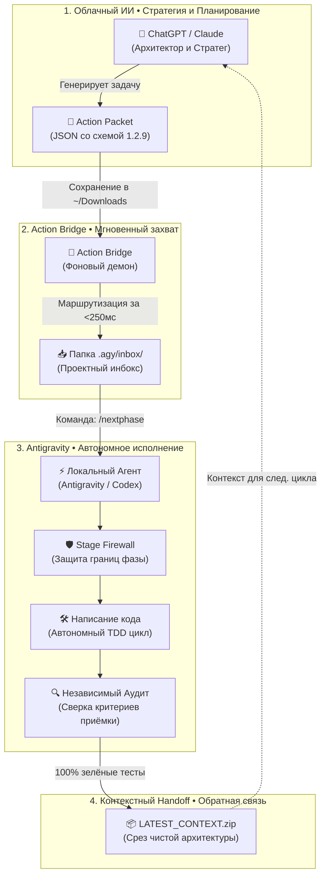

<div align="center">

# ⚡ Agentic Pipeline `v1.2.27`

### *Эталонная реализация Handoff-Driven Development (HDD) для Antigravity и ИИ-Компаньонов*

[](VERSION.json)
[](docs/concepts/OPERATING_MODEL.ru.md)
[](docs/concepts/OPERATING_MODEL.ru.md)
[](scripts/bridge/README.md)
[](.agents/rules/63-scientific-stage-firewall.md)
[](LICENSE)

<p align="center">
  <b><a href="README.md">🇬🇧 English</a></b> • <b><a href="README.ru.md">🇷🇺 Русский</a></b> • <b><a href="docs/reference/COMMANDS_AND_SKILLS_DIRECTORY.md">🧭 Атлас Скиллов и Команд</a></b> • <b><a href="docs/guides/BARE_ANTIGRAVITY_SETUP.ru.md">🚀 Старт за 3 шага</a></b>
</p>

---

</div>

## 🌐 Мета Handoff-Driven Development (HDD)

Эпоха **одноагентных бесконечных промпт-сессий** подошла к концу. Деградация контекста, скрытые галлюцинации и сломанные сборки неизбежны, когда одна модель пытается одновременно быть Архитектором, Кодером, Тестировщиком и Аудитором в одной запутанной ветке диалога.

**Agentic Pipeline — это эталонная реализация архитектуры Handoff-разработки:**

```text
┌─────────────────────────────────────────────────────────────────────────────────────────────┐
│                          ЖИЗНЕННЫЙ ЦИКЛ HANDOFF-РАЗРАБОТКИ (HDD)                            │
├─────────────────────────────────────────────────────────────────────────────────────────────┤
│                                                                                             │
│  [1. СТРАТЕГ / ОБЛАЧНЫЙ ИИ]                                                                 │
│   ChatGPT / Claude / GPT-5  ──(Формирует задачу)──►  AGENTIC_ACTION_PACKET_*.json           │
│                                                                  │                          │
│                                                          (Скачивание)                       │
│                                                                  ▼                          │
│  [2. БЕСШОВНЫЙ МОСТ ЗАДАЧ]                                                                  │
│   Action Bridge Демон (250мс)  ──(Проверка токена)──►  Папка проекта .agy/inbox/           │
│                                                                  │                          │
│                                                          (/nextphase)                       │
│                                                                  ▼                          │
│  [3. АВТОНОМНЫЙ АГЕНТ ANTIGRAVITY]                                                          │
│   Antigravity IDE / Codex   ──►  Проверка Stage Firewall  ──►  Автономный TDD цикл          │
│                                                                  │                          │
│                                                          (100% Green)                       │
│                                                                  ▼                          │
│  [4. КОНТЕКСТНЫЙ HANDOFF И РЕЛИЗ]                                                           │
│   LATEST_CONTEXT.zip (1-2 МБ)  ◄──(Независимый аудит)──  Машинный отчёт и чеки              │
│         │                                                                                   │
│         └────────────────(Возврат Стратегу для следующего цикла)────────────────────────────►┘
```

---

## 🗺️ Архитектурная схема взаимодействия


```mermaid
flowchart TD
    subgraph S1["1. Облачный ИИ • Стратегия и Планирование"]
        A["🧠 ChatGPT / Claude<br/>(Архитектор и Стратег)"]
        B["📄 Action Packet<br/>(JSON со схемой 1.2.9)"]
        A -->|"Генерирует задачу"| B
    end

    subgraph S2["2. Action Bridge • Мгновенный захват"]
        C["🌉 Action Bridge<br/>(Фоновый демон)"]
        D["📥 Папка .agy/inbox/<br/>(Проектный инбокс)"]
        C -->|"Маршрутизация за &lt;250мс"| D
    end

    subgraph S3["3. Antigravity • Автономное исполнение"]
        E["⚡ Локальный Агент<br/>(Antigravity / Codex)"]
        F["🛡️ Stage Firewall<br/>(Защита границ фазы)"]
        G["🛠️ Написание кода<br/>(Автономный TDD цикл)"]
        H["🔍 Независимый Аудит<br/>(Сверка критериев приёмки)"]
        E --> F --> G --> H
    end

    subgraph S4["4. Контекстный Handoff • Обратная связь"]
        I["📦 LATEST_CONTEXT.zip<br/>(Срез чистой архитектуры)"]
    end

    B -->|"Сохранение в ~/Downloads"| C
    D -->|"Команда: /nextphase"| E
    H -->|"100% зелёные тесты"| I
    I -.->|"Контекст для след. цикла"| A
```

---

## 🚀 Развёртывание на «голом» Antigravity за 2 минуты

Установите и запустите экосистему на чистой машине за **3 простые команды**:

### Шаг 1. Клонируйте репозиторий
```powershell
cd "$env:USERPROFILE\Documents\antigravity"
git clone https://github.com/0xAgentive/agentic-pipeline.git
cd agentic-pipeline
```

### Шаг 2. Установите глобальные скиллы в 1 клик
```powershell
& pwsh -NoProfile -ExecutionPolicy Bypass -File "./scripts/windows/Install-GlobalSkills.ps1"
```
*Скрипт автоматически зарегистрирует все 6 глобальных скиллов (`agentic-project-scaffold`, `companion-project-context-pack`, `local-artifact-delivery` и др.) в системном каталоге `~/.gemini/config/skills/`.*

### Шаг 3. Создайте свой первый проект!
Откройте диалог в Antigravity и напишите:
```text
/new-project MyCoolProject
```
*Готово! Агент инициализирует Git, развернёт стандарты управления, зарегистрирует Action Bridge и сразу выдаст начальный ZIP-архив для ChatGPT.*

*(Для подключения существующего проекта напишите: `/adopt-project C:\путь\к\репозиторию`)*

---

## 🚀 Ключевые возможности

<table>
  <tr>
    <td width="50%">
      <h3>⚡ Action Bridge (Захват за миллисекунды)</h3>
      <p>Вы скачиваете файл задачи из диалога с ChatGPT, и фоновый мост за <b>&lt; 250 мс</b> аутентифицирует и доставляет его прямо в рабочий каталог проекта без ручного копирования.</p>
    </td>
    <td width="50%">
      <h3>📦 Контекстный упаковщик чистой архитектуры</h3>
      <p>Упаковывает 100% исходного кода, схем, алгоритмов и тестов в компактный <b>1–2 МБ ZIP</b> для ChatGPT, аккуратно отсекая гигабайты <code>node_modules</code>, дампов и логов.</p>
    </td>
  </tr>
  <tr>
    <td width="50%">
      <h3>🛡️ Научный брандмауэр (Stage Firewall)</h3>
      <p>Жёсткий детерминированный контроль, исключающий самовольный скачок между глобальными фазами проекта (например, запрет на использование закрытых клинических данных на аналитической стадии).</p>
    </td>
    <td width="50%">
      <h3>🎯 Создание проектов в один клик</h3>
      <p>Инициализация нового проекта или онбординг существующего репозитория одной фразой: <code>/new-project &lt;Имя&gt;</code> или <code>/adopt-project &lt;Путь&gt;</code>.</p>
    </td>
  </tr>
</table>

---

## 🧭 Шпаргалка основных команд

| Команда | Категория | Для чего нужна (простыми словами) | Пример использования |
|:---|:---:|:---|:---|
| **`/new-project`** | 🚀 Старт | Создание нового проекта под ключ по одному названию | `/new-project MyProject` |
| **`/adopt-project`** | 🚀 Старт | Подключение существующего репозитория без изменения старого кода | `/adopt-project C:\repo` |
| **`/companion-pack`** | 📦 Контекст | Сборка чистого архитектурного кода для ChatGPT/Claude в 1 МБ ZIP | `/companion-pack` |
| **`/nextphase`** | ⚙️ Исполнение | Автономное выполнение утвержденной задачи Action Packet | `/nextphase` или *«делай»* |
| **`/goal`** | 🧠 Режим | Модификатор сверхупорства: работать без пауз до 100% верификации | `/nextphase /goal` |
| **`/auditphase`** | 🔍 Аудит | Независимый аудит критериев приёмки и точности метрик | `/auditphase` |
| **`/fixcritical`** | 🔧 Ремонт | Изолированное исправление дефектов, найденных аудитом | `/fixcritical` |
| **`/fastpatch`** | ⚡ Патч | Быстрое точечное исправление (1–3 строки, опечатки, конфиги) | `/fastpatch` |
| **`/stitch-sync`** | 🎨 UI/UX | Экспорт экранов и токенов дизайна в интерактивный Google Stitch | `/stitch-sync` |
| **`/interview-me`** | 💡 Мышление | Инженерный опрос по одному вопросу за раз для кристаллизации идеи | *«проведи интервью»* |

👉 **[Открыть полный интерактивный Атлас всех 24+ скиллов и команд →](docs/reference/COMMANDS_AND_SKILLS_DIRECTORY.md)**  
👉 **[Запустить интерактивную веб-панель (UI Dashboard) →](docs/reference/COMMANDS_AND_SKILLS_DASHBOARD.html)**

---

## 📂 Структура репозитория

```text
agentic-pipeline/
├── .agents/                    # Универсальные правила, воркфлоу и скиллы агентов
│   ├── rules/                  # Правила управления, безопасности и Stage Firewall
│   ├── skills/                 # Инженерные скиллы (TDD, Code Review, Security и др.)
│   └── workflows/              # Слэш-команды (/nextphase, /auditphase, /fixcritical)
├── .agy/                       # Машинный Control Plane и манифесты верификации
├── docs/                       # Полная база знаний и руководства (EN/RU)
│   ├── guides/                 # Пошаговые руководства по установке
│   ├── concepts/               # Теоретические модели и принципы
│   └── reference/              # Канонический атлас, схемы и шпаргалки
├── schemas/                    # Формальные JSON-схемы (Action Packet 1.2.9, Findings)
├── scripts/                    # Инструменты автоматизации
│   ├── bridge/                 # Companion Action Bridge (мгновенный захват задач)
│   ├── control-plane/          # Node.js валидаторы и раннеры конвергенции
│   └── windows/                # PowerShell 7 установщики и тестовые раннеры
├── skills/                     # Дистрибутив глобальных скиллов Antigravity
└── templates/                  # Шаблоны для генерации новых проектов
```

---

## 🔒 Гарантии безопасности и приватности

1. **100% Офлайн-выполнение продукта**: Никакие закрытые ключи, пароли, записи БД или локальные данные не передаются во внешние API при локальном исполнении.
2. **Детерминированная очистка данных (Privacy Scrubber)**: Action Packets и контекстные архивы автоматически удаляют персональные имена, серийные номера устройств и абсолютные пути `C:\...`.
3. **Криптографическая изоляция проектов**: Для каждого проекта выпускается уникальный 64-hex токен (`ACTION_BRIDGE_CAPABILITY.json`), исключающий случайное исполнение чужого пакета.

---

## 📄 Лицензия и стандарты

- **Лицензия**: MIT License (см. [LICENSE](LICENSE)).
- **Стандарт экосистемы**: Agentic Pipeline Specification `v1.2.27`.
- **Поддержка**: Google Antigravity & Agentic Engineering Community.
