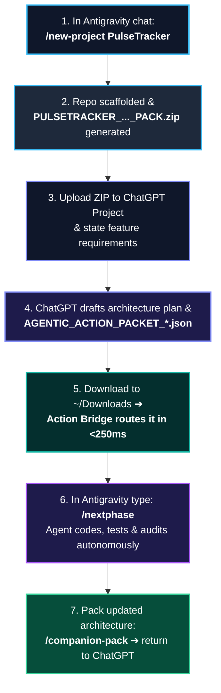

# 🧭 Complete Guide: New Project End-to-End Workflow

> **From Raw Idea to Verified Production Code with Handoff-Driven Development (HDD)**  
> Ecosystem: `Agentic Pipeline v1.2.27` • Integration: **Antigravity + ChatGPT / Claude**

This guide provides an exhaustive walkthrough of all prerequisites, setting up your cloud Companion, and executing the complete lifecycle of a new project from scratch.

---

## 📋 1. Prerequisites: What You Need to Get Started

To operate smoothly in the asymmetric dual-agent paradigm, you will need:

### 1. Two AI Subscriptions
1. **Google AI Pro / Gemini Advanced (for Antigravity IDE)**:
   - Grants access to the Google Antigravity desktop IDE and Gemini 3.7 Pro / Flash / Claude 3.7 Sonnet coding models.
2. **ChatGPT Plus / Pro / Team (or Claude Pro) (for Cloud Strategist)**:
   - Provides access to advanced reasoning models (GPT-5, GPT-4o, Claude 3.7) with **Code Interpreter / Advanced Data Analysis** enabled (required to compile and export downloadable `AGENTIC_ACTION_PACKET_*.json` files).

### 2. Local Developer Environment
- **Operating System**: Windows 10/11 (or Linux / macOS).
- **Git**: Installed and configured (`git config --global user.name "..."`, `git config --global user.email "..."`).
- **PowerShell 7+ (`pwsh`)**: Modern cross-platform shell.
- **Node.js (v18+)** and **Python (3.10+)**: For runtime validators and the Companion Action Bridge.
- **Google Antigravity IDE**: Installed and running.

---

## 🧠 2. Setting Up Your Cloud Companion (ChatGPT / Claude) in 3 Minutes

All reference instructions and knowledge modules are located in the [`docs/companion/`](https://github.com/0xAgentive/agentic-pipeline/tree/main/docs/companion) folder of this repository.

### Setup Instructions for ChatGPT (Project or Custom GPT):

1. **Create a ChatGPT Project**:
   - In ChatGPT, click **Projects** ➔ **Create Project** (e.g. named *«Agentic Architect»*).
2. **Set the System Prompt (Instructions)**:
   - In the **Instructions** tab, paste the complete content of [`docs/companion/SYSTEM_PROMPT_GPT56_COMPANION_v1.2.27.md`](https://github.com/0xAgentive/agentic-pipeline/blob/main/docs/companion/SYSTEM_PROMPT_GPT56_COMPANION_v1.2.27.md) (or [`docs/companion/01_PROJECT_INSTRUCTIONS_v1.2.27.md`](https://github.com/0xAgentive/agentic-pipeline/blob/main/docs/companion/01_PROJECT_INSTRUCTIONS_v1.2.27.md)).
3. **Upload Knowledge Files**:
   - In the **Files / Knowledge** section, upload:
     - All modules from `docs/companion/` (files `00_...md` through `15_...md` or the bundled [`docs/companion/companion.zip`](https://github.com/0xAgentive/agentic-pipeline/blob/main/docs/companion/companion.zip));
     - The Action Packet JSON schema: [`schemas/companion/action-packet.schema.json`](https://github.com/0xAgentive/agentic-pipeline/blob/main/schemas/companion/action-packet.schema.json).
4. **Enable Code Capabilities**:
   - Ensure the **Code Interpreter / Advanced Data Analysis** checkbox is checked (enabling the model to generate download links for Action Packets).

---

## 🔄 3. Step-by-Step End-to-End Development Lifecycle



---

### Step-by-Step Walkthrough:

### Step 1. Initialize the Project in Antigravity
Open any chat in Antigravity and trigger the global skill:
```text
/new-project PulseTracker
```
*What happens automatically:*
- Creates the project workspace directory `C:\Users\<You>\Documents\antigravity\PulseTracker`;
- Initializes a clean Git repository on the `main` branch;
- Deploys workflows (`/nextphase`, `/auditphase`), safety rules, and the Stage Firewall;
- Generates a unique 64-hex capability token `ACTION_BRIDGE_CAPABILITY.json` and registers the project in the background Action Bridge;
- Automatically packages the initial pure architecture context ZIP: `PULSETRACKER_COMPREHENSIVE_COMPANION_PACK.zip`.

---

### Step 2. Hand Off Context to ChatGPT
1. Open your ChatGPT Project.
2. Click the attachment icon and upload:
   `PULSETRACKER_COMPREHENSIVE_COMPANION_PACK.zip`.
3. The Companion inspects 100% of your clean architecture without any noise or bloat.

---

### Step 3. Plan the Feature with Your Companion
Describe the desired feature in plain language:
> *«Let's implement Karvonen heart rate training zones (Zone 1-5), strict TypeScript contracts, and comprehensive Vitest unit test suites»*.

The Companion:
1. Presents an architectural design summary for you to review;
2. Compiles a schema-valid machine task:
   `AGENTIC_ACTION_PACKET_pulsetracker_20260819_123000.json`.

---

### Step 4. Download and Automatic Sub-Second Routing (Action Bridge)
1. Click the download link for the JSON file in your browser (saved to your `Downloads` directory).
2. **Zero manual action required!**
   The background daemon `AgenticPipelineCompanionActionBridge` in **&lt; 250 milliseconds**:
   - Ingests the packet from `Downloads`;
   - Validates the token and cryptographic signature;
   - Moves the file into `PulseTracker/.agy/inbox/ACTIVE_ACTION_PACKET/`;
   - Logs an `ACTION_PACKET_RECEIPT.json` receipt.

---

### Step 5. Autonomous Local Execution in Antigravity
Open the `PulseTracker` chat window in Antigravity and type:
```text
/nextphase
```
*(or `/nextphase /goal` for uninterrupted deep execution)*.

*Antigravity autonomously:*
- Validates the Stage Firewall and acceptance criteria;
- Implements production source code in `src/`;
- Writes and runs unit and integration tests in `tests/`;
- Runs an independent audit and logs machine evidence;
- Outputs a concise 4-section summary for the owner.

---

### Step 6. Closing the Loop & Next Iteration
When the work item is complete:
1. Run:
   ```text
   /companion-pack
   ```
2. Attach the fresh `PULSETRACKER_COMPREHENSIVE_COMPANION_PACK.zip` to your ChatGPT Project.
3. Proceed to the next feature!

---

*See full command and skill specifications in the [Atlas of Skills & Commands](../reference/COMMANDS_AND_SKILLS_DIRECTORY.md).*
