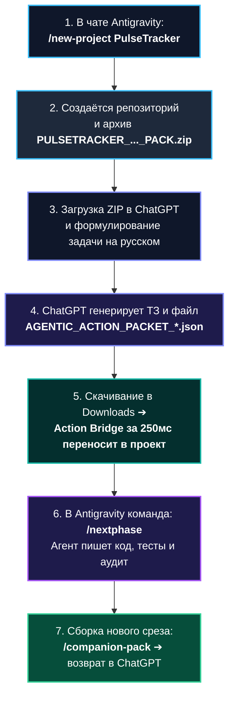

# 🧭 Полное руководство: Разработка нового проекта с нуля (End-to-End Workflow)

> **От идеи до релизного кода в парадигме Handoff-Driven Development (HDD)**  
> Экосистема: `Agentic Pipeline v1.2.27` • Интеграция: **Antigravity + ChatGPT / Claude**

В этом руководстве подробно описаны все предварительные требования, настройка облачного Компаньона и полный пошаговый цикл работы над новым проектом.

---

## 📋 1. Пререквизиты: Что нужно иметь на старте

Для комфортной работы в двухагентной асимметричной парадигме вам понадобятся:

### 1. Две подписки на ИИ-сервисы
1. **Google AI Pro / Gemini Advanced (для Antigravity IDE)**:
   - Обеспечивает доступ к среде Google Antigravity и моделям Gemini 3.7 Pro / Flash, Claude 3.7 Sonnet внутри редактора.
2. **ChatGPT Plus / Pro / Team (или Claude Pro) (для Облачного Стратега)**:
   - Необходим доступ к продвинутым моделям рассуждений (GPT-5, GPT-4o, Claude 3.7) и обязательно включённый **Code Interpreter / Advanced Data Analysis** (для генерации и выгрузки скачиваемых файлов задач `AGENTIC_ACTION_PACKET_*.json`).

### 2. Локальное окружение разработчика
- **Операционная система**: Windows 10/11 (или Linux / macOS).
- **Git**: установлен и настроен (`git config --global user.name "..."`, `git config --global user.email "..."`).
- **PowerShell 7+ (`pwsh`)**: современная версия PowerShell.
- **Node.js (v18+)** и **Python (3.10+)**: для работы валидаторов и Action Bridge.
- **Google Antigravity IDE**: установлена и запущена.

---

## 🧠 2. Настройка Облачного Компаньона (ChatGPT / Claude) за 3 минуты

Все эталонные инструкции и файлы базы знаний лежат в папке [`docs/companion/`](https://github.com/0xAgentive/agentic-pipeline/tree/main/docs/companion) репозитория.

### Инструкция для ChatGPT (Project или Custom GPT):

1. **Создайте Project в ChatGPT**:
   - В интерфейсе ChatGPT нажмите **Projects** ➔ **Create Project** (назовите его, например, *«Agentic Architect»*).
2. **Установите системные инструкции (System Prompt)**:
   - Откройте вкладку **Instructions** проекта.
   - Скопируйте и вставьте текст из файла [`docs/companion/SYSTEM_PROMPT_GPT56_COMPANION_v1.2.27.md`](https://github.com/0xAgentive/agentic-pipeline/blob/main/docs/companion/SYSTEM_PROMPT_GPT56_COMPANION_v1.2.27.md) (или [`docs/companion/01_PROJECT_INSTRUCTIONS_v1.2.27.md`](https://github.com/0xAgentive/agentic-pipeline/blob/main/docs/companion/01_PROJECT_INSTRUCTIONS_v1.2.27.md)).
3. **Загрузите файлы базы знаний (Knowledge Files)**:
   - В раздел **Files / Knowledge** проекта загрузите:
     - Все модули правил из папки `docs/companion/` (файлы `00_...md` — `15_...md` или готовый архив [`docs/companion/companion.zip`](https://github.com/0xAgentive/agentic-pipeline/blob/main/docs/companion/companion.zip));
     - JSON-схему пакета задач: [`schemas/companion/action-packet.schema.json`](https://github.com/0xAgentive/agentic-pipeline/blob/main/schemas/companion/action-packet.schema.json).
4. **Проверьте настройки возможностей**:
   - Убедитесь, что галочка **Code Interpreter / Advanced Data Analysis** активна (это позволяет модели компилировать чистые JSON Action Packets).

---

## 🔄 3. Пошаговый сквозной цикл разработки с нуля



---

### Подробное описание каждого шага:

### Шаг 1. Инициализация проекта в Antigravity
Откройте любой диалог в Antigravity и вызовите глобальный скилл:
```text
/new-project PulseTracker
```
*Что происходит:*  
- Создаётся папка проекта `C:\Users\<Вы>\Documents\antigravity\PulseTracker`;
- Инициализируется Git-репозиторий на ветке `main`;
- Разворачиваются воркфлоу (`/nextphase`, `/auditphase`), правила безопасности и Stage Firewall;
- Генерируется уникальный токен `ACTION_BRIDGE_CAPABILITY.json` и проект регистрируется в фоновом Action Bridge;
- Автоматически собирается первый архив: `PULSETRACKER_COMPREHENSIVE_COMPANION_PACK.zip`.

---

### Шаг 2. Передача архитектуры в ChatGPT
1. Откройте ваш Project в ChatGPT.
2. Нажмите скрепку (прикрепить файл) и выберите сгенерированный архив:
   `PULSETRACKER_COMPREHENSIVE_COMPANION_PACK.zip`.
3. Модель распакует и моментально изучит 100% чистой архитектуры проекта (без мусора и логов).

---

### Шаг 3. Проектирование с Компаньоном
Напишите своими словами, какую фичу вы хотите реализовать:
> *«Давай создадим модуль расчёта зон пульса по формуле Карвонена (Zone 1-5), добавим строгие TypeScript-типы и напишем юнит-тесты на Vitest»*.

Компаньон:
1. Составит понятный архитектурный план для вас;
2. Сгенерирует машиночитаемый файл задачи:
   `AGENTIC_ACTION_PACKET_pulsetracker_20260819_123000.json`.

---

### Шаг 4. Скачивание и моментальный автозахват (Action Bridge)
1. Нажмите на ссылку скачивания файла задачи в браузере (он сохранится в вашу стандартную папку `Downloads`).
2. **Вам больше ничего не нужно делать вручную!**
   Фоновый процесс `AgenticPipelineCompanionActionBridge` за **250 миллисекунд**:
   - Перехватит файл из `Downloads`;
   - Проверит цифровую подпись и токен проекта;
   - Переместит пакет в `PulseTracker/.agy/inbox/ACTIVE_ACTION_PACKET/`;
   - Запишет подтверждающую квитанцию `ACTION_PACKET_RECEIPT.json`.

---

### Шаг 5. Автономное исполнение в Antigravity
Откройте диалог в проекте `PulseTracker` в Antigravity и напишите:
```text
/nextphase
```
*(или `/nextphase /goal` для сложных задач, чтобы агент работал без остановок до 100% зелёных тестов)*.

*Что делает Antigravity:*
- Читает Action Packet и проверяет научный брандмауэр (Stage Firewall);
- Пишет код в `src/` строго по контракту;
- Создаёт и запускает тесты в `tests/`;
- Проводит независимый аудит и формирует машинный отчёт;
- Выдаёт вам краткое человеческое резюме из 4 пунктов.

---

### Шаг 6. Замыкание цикла и следующая итерация
Когда фаза завершена:
1. Вызовите команду:
   ```text
   /companion-pack
   ```
2. Новый легкий срез архитектуры `PULSETRACKER_COMPREHENSIVE_COMPANION_PACK.zip` готов.
3. Прикрепите его в ChatGPT и переходите к следующей фиче!

---

*Справка по всем командам и скиллам доступна в [Атласе Скиллов и Команд](../reference/COMMANDS_AND_SKILLS_DIRECTORY.md).*
