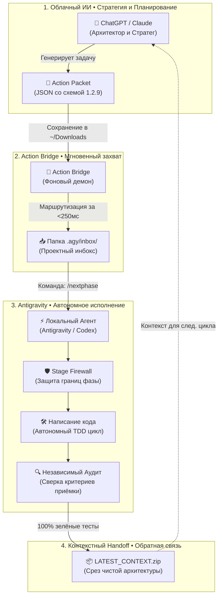

# 🧭 Атлас Скиллов и Команд Agentic Pipeline

> **Справочник для человека и агентов**  
> Версия экосистемы: `1.2.27` | Статус: **Обязательный стандарт пайплайна**

В этом руководстве простым и наглядным языком описаны все инструменты, команды и скиллы экосистемы **Agentic Pipeline**. Вам не нужно быть программистом или помнить сложные синтаксические конструкции — используйте этот документ как интерактивную шпаргалку.

---

## 🗺️ Жизненный цикл разработки в пайплайне

```text
┌─────────────────────────────────────────────────────────────────────────────────────────────┐
│                          ЖИЗНЕННЫЙ ЦИКЛ HANDOFF-РАЗРАБОТКИ (HDD)                            │
├─────────────────────────────────────────────────────────────────────────────────────────────┤
│                                                                                             │
│  [1. СТРАТЕГ / ОБЛАЧНЫЙ ИИ]                                                                 │
│   ChatGPT / Claude / GPT-5  ──(Формирует задачу)──►  AGENTIC_ACTION_PACKET_*.json           │
│                                                                  │                          │
│                                                          (Скачивание)                       │
│                                                                  ▼                          │
│  [2. БЕСШОВНЫЙ МОСТ ЗАДАЧ]                                                                  │
│   Action Bridge Демон (250мс)  ──(Проверка токена)──►  Папка проекта .agy/inbox/           │
│                                                                  │                          │
│                                                          (/nextphase)                       │
│                                                                  ▼                          │
│  [3. АВТОНОМНЫЙ АГЕНТ ANTIGRAVITY]                                                          │
│   Antigravity IDE / Codex   ──►  Проверка Stage Firewall  ──►  Автономный TDD цикл          │
│                                                                  │                          │
│                                                          (100% Green)                       │
│                                                                  ▼                          │
│  [4. КОНТЕКСТНЫЙ HANDOFF И РЕЛИЗ]                                                           │
│   LATEST_CONTEXT.zip (1-2 МБ)  ◄──(Независимый аудит)──  Машинный отчёт и чеки              │
│         │                                                                                   │
│         └────────────────(Возврат Стратегу для следующего цикла)────────────────────────────►┘
```



---

## ⚡ 1. Шпаргалка «Что мне написать, если я хочу...»

Используйте эту таблицу для быстрого решения ваших повседневных задач:

| Ваша задача | Что написать в чат | Что произойдёт простыми словами |
|---|---|---|
| **Создать новый проект с нуля** | `/new-project MyProject` | Создастся папка, чистый Git, рантайм пайплайна и сразу готовый ZIP-архив для ChatGPT. |
| **Подключить существующий проект** | `/adopt-project C:\путь\к\проекту` | Пайплайн аккуратно внедрится в ваш репозиторий, не изменив ни одной строчки старого кода. |
| **Отдать проект в ChatGPT / Claude** | `/companion-pack` | Соберётся легкий архив (1–2 МБ) со 100% чистой архитектуры без тяжелых логов и `node_modules`. |
| **Запустить выполнение скачанной задачи** | `/nextphase` или *«делай»* | Агент считает Action Packet с диска и автономно выполнит все пункты ТЗ. |
| **Запустить долгую задачу без остановок** | `/nextphase /goal` | Агент включит режим сверхупорства и не остановится до 100% зелёного отчёта. |
| **Проверить качество и найти баги** | `/auditphase` | Запустится строгий независимый аудит без внесения изменений в код. |
| **Исправить найденный критический баг** | `/fixcritical` | Агент изолированно исправит конкретный дефект из реестра замечаний. |
| **Внести точечную правку (1–2 строки)** | `/fastpatch` | Быстрое применение мелкого фикса в обход тяжелых стадий. |
| **Проверить идею и выявить пробелы** | `/interview-me` | ИИ начнет задавать вам по одному уточняющему вопросу, чтобы докопаться до сути. |
| **Синхронизировать дизайн со Stitch** | `/stitch-sync` | Все экраны и токены стилей вашего веб-приложения улетят в интерактивный Google Stitch. |

---

## 🎮 2. Сводный реестр всех Слэш-Команд

| Команда | Категория | Для чего нужна (простыми словами) | Когда вызывать | Что делает под капотом |
|:---|:---:|:---|:---|:---|
| `/new-project` | 🚀 Старт | Создание нового проекта под ключ по одному названию | На старте новой идеи | `git init`, накат `.agents/` и `.agy/`, регистрация в Action Bridge, генерация ZIP для ChatGPT |
| `/adopt-project` | 🚀 Старт | Онбординг любого существующего репозитория | При подключении старого проекта | Накат слоя управления без перезаписи существующего кода, выпуск токена |
| `/companion-pack` | 📦 ИИ-мост | Упаковка всего кода для ChatGPT / GPT-5 / Claude | Перед началом проектирования | Изоляция чистого дерева `src/`, генерация карты кода, формул, промпта и сборка ZIP |
| `/nextphase` | ⚙️ Исполнение | Запуск и выполнение утвержденной задачи | После скачивания Action Packet | Чтение `ACTIVE_ACTION_PACKET.json`, проход через Stage Firewall, кодинг, тесты |
| `/auditphase` | 🔍 Контроль | Полный независимый аудит кодовой базы | Для проверки перед сдачей | Прогон матрицы покрытия, сверка метрик, проверка на запрещенные клинические фразы |
| `/fixcritical` | 🔧 Ремонт | Изолированное устранение дефектов | Когда аудит нашел блокер | Прицельное исправление ошибки из `FINDINGS.json` с последующей перепроверкой |
| `/fastpatch` | ⚡ Патч | Быстрое точечное исправление | Мелкие опечатки, конфиги | Применение патча с минимальными накладными расходами |
| `/planonly` | 📝 План | Составление плана без изменения файлов | Когда нужно сначала подумать | Формирование `implementation_plan.md` без модификации исходников |
| `/shipcheck` | 🚢 Релиз | Финальная предрелизная проверка | Перед публикацией версии | Проверка целостности дистрибутива, хешей, манифестов и документации |
| `/goal` | 🧠 Режим | Модификатор непрерывной автономности | Для тяжелых задач на 15–60 мин | Установка хост-модели на работу до полного достижения цели без пауз |
| `/stitch-sync` | 🎨 Дизайн | Экспорт дизайна в Google Stitch | Для презентации UI | Извлечение CSS/Tailwind токенов, загрузка в Stitch MCP, генерация экранов |
| `/browser` | 🌐 Тесты | Запуск тестов в реальном браузере | Проверка UI / DOM | Управление Chrome через DevTools MCP, снятие скриншотов, анализ консоли |
| `/grill-me` | 💡 Брейншторм | Инженерный допрос и стресс-тест плана | До начала кодинга | Серия глубоких вопросов для выявления скрытых рисков архитектуры |

---

## 🌟 3. Глобальные Скиллы Экосистемы Agentic Pipeline

Эти скиллы разработаны специально для связки **Человек ↔ ChatGPT / Claude ↔ Antigravity**:

```text
┌──────────────────────────────────────────────────────────────────────────────────┐
│                             AGENTIC PIPELINE ECOSYSTEM                           │
├──────────────────────────────┬────────────────────────────┬──────────────────────┤
│ 🚀 agentic-project-scaffold  │ 📦 companion-project-pack  │ 🛡️ quota-safe-flow   │
│ Создание и онбординг         │ Сборка контекста для ИИ    │ Сохранение квот/чек  │
├──────────────────────────────┼────────────────────────────┼──────────────────────┤
│ 💎 local-artifact-delivery   │ 🎨 stitch-design-sync      │ 🔌 mcp-discipline    │
│ Компактные отчеты владельцу  │ Экспорт экранов в Stitch   │ Безопасный MCP-стек  │
└──────────────────────────────┴────────────────────────────┴──────────────────────┘
```

### 1. `agentic-project-scaffold` (Фабрика проектов)
- **Суть:** Позволяет по одному слову развернуть полностью настроенный репозиторий со всеми стандартами качества v1.2.27.
- **Триггеры:** `/new-project`, `/adopt-project`, *«создай проект под пайплайном»*, *«подключи репозиторий»*.
- **Результат:** Рабочая папка + регистрация в Action Bridge + готовый архив для ChatGPT.

### 2. `companion-project-context-pack` (Мост в ChatGPT / Claude)
- **Суть:** Извлекает 100% архитектурного кода, отсекает гигабайты мусора (`node_modules`, дампы датчиков, виртуальные окружения) и формирует идеальный компактный ZIP (1–3 МБ).
- **Триггеры:** `/companion-pack`, `/companion-context`, *«сделай пакет для компаньона»*, *«экспортируй проект для ChatGPT»*.
- **Результат:** `<PROJECT>_COMPREHENSIVE_COMPANION_PACK.zip` с полным кодом, формулами и системным промптом.

### 3. `local-artifact-delivery` (Чистые отчёты владельцу)
- **Суть:** Правило компактной выдачи результатов. Запрещает загромождать чат простынями технических хешей, временных файлов и битых markdown-ссылок.
- **Формат:** 4 понятные секции («Что происходит», «Что сделано», «Что дальше», «Нужно ли что-то от владельца») + блок `АРТЕФАКТЫ` с чистыми путями.

### 4. `quota-safe-continuity` (Защита от потери контекста и квот)
- **Суть:** Автоматически создает контрольные точки состояния перед тяжелыми шагами (миграции, долгие билды). Если сессия прервется — работа восстановится с того же места без потери прогресса.

### 5. `stitch-design-sync` (Синхронизация дизайна с Google Stitch)
- **Суть:** Извлекает из React/HTML цветовую палитру, типографику, кнопки и карточки, и воссоздает интерактивные макеты в Google Stitch через Stitch MCP.

### 6. `mcp-tooling-discipline` (Дисциплина внешних инструментов)
- **Суть:** Безопасное управление серверами MCP (Codebase Memory, Context7, DevTools, GitHub), исключающее галлюцинации и утечки токенов.

---

## 🧠 4. Инженерные и Методологические Скиллы (Agent Skills)

В экосистему интегрирована библиотека передовых отраслевых инженерных практик:

### 💡 Этап 1: Мышление, Требования и Архитектура
- **`interview-me`** — Допрос с пристрастием. Задает по одному вопросу, пока понимание задачи не достигнет 95%.
- **`idea-refine`** — Огранка сырых идей. Разворачивает мысли в структурированные концепции.
- **`spec-driven-development`** — Разработка от спецификации. Сначала формулирует строгий контракт, затем код.
- **`doubt-driven-development`** — Адвокат дьявола. Подвергает критическому сомнению любое нетривиальное решение до его внедрения.
- **`api-and-interface-design`** — Проектирование стабильных, расширяемых REST/GraphQL и TypeScript интерфейсов.

### 🛠️ Этап 2: Чистая Разработка и Кодинг
- **`test-driven-development` (TDD)** — Сначала пишется падающий тест, затем минимальный код для его прохождения.
- **`source-driven-development`** — Опора только на официальную документацию библиотек, без устаревших паттернов.
- **`incremental-implementation`** — Пошаговое дробление крупных изменений на микро-коммиты.
- **`code-simplification`** — Безжалостный рефакторинг для упрощения читаемости без изменения логики.
- **`frontend-ui-engineering`** — Создание премиальных, отзывчивых и доступных интерфейсов.

### 🛡️ Этап 3: Качество, Безопасность и Производительность
- **`code-review-and-quality`** — Сквозное рецензирование по 5 осям (корректность, читаемость, архитектура, безопасность, скорость).
- **`security-and-hardening`** — Защита от инъекций, утечек памяти, проверка валидации пользовательского ввода.
- **`performance-optimization`** — Профилирование узких мест, оптимизация Core Web Vitals и алгоритмической сложности.
- **`observability-and-instrumentation`** — Внедрение структурированных логов, трейсов и метрик.
- **`debugging-and-error-recovery`** — Системный поиск первопричины багов (Root Cause Analysis) вместо стрельбы наугад.

### 🚢 Этап 4: Поставка и Инфраструктура
- **`ci-cd-and-automation`** — Настройка пайплайнов сборки и автоматических проверок.
- **`git-workflow-and-versioning`** — Ветки, семантическое версионирование, чистая история коммитов.
- **`shipping-and-launch`** — Чек-листы перед релизом, план отката, мониторинг запуска.
- **`browser-testing-with-devtools`** — Автоматическое тестирование в реальном браузере через Chrome DevTools MCP.

---

## 📌 Как вызвать любой скилл вручную

Любой скилл активируется естественным языком прямо в диалоге с агентом:

```text
- «Примени скилл test-driven-development для создания модуля X»
- «Проведи мне интервью через interview-me по новой идее»
- «Сделай рефакторинг этого компонента через code-simplification»
- «Проверь безопасность формы через security-and-hardening»
```

---

*Документ входит в обязательный состав дистрибутива Agentic Pipeline v1.2.27 и синхронизируется во все создаваемые проекты.*
